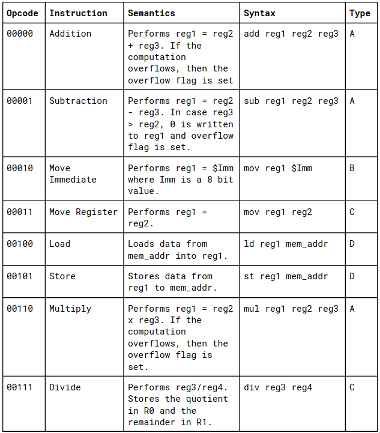
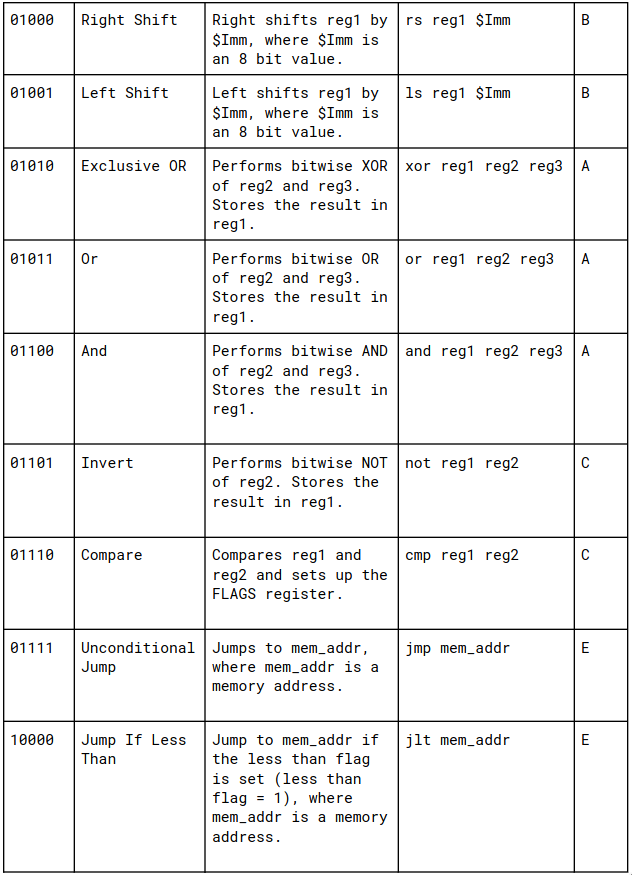
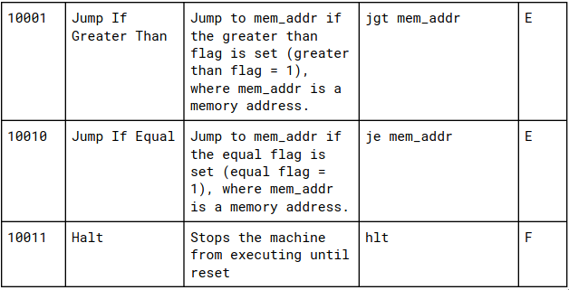

## About code
* The assembler code is in the `Simple-Assembler` directory. The commands to execute the assembler is `Simple-Assembler/run`.
* The simulator code in the `SimpleSimulator` directory. The commands to execute the assembler is `SimpleSimulator/run`.
* Both the assembler and the simulator read from `stdin` and writes to `stdout`.

## Some tests
* Go to the `Testing` directory to find some test cases for both assembler and simulator.

## Checking memory access
* Plot with the cycle number (x-axis) and the memory address (y-axis). To check which memory address is accessed at what cycle.
* Conclusion from plot: Memory addresses near to fetched address are more likely to be fetched.

## Shape of data dump
* data dump is of form 8 space separated 16 bit binary numbers denoting the values of the registers (R0, R1, ... R6 and FLAGS) (8 registers including FLAG).
* Dump of 16 bit memory after exicuting each line of program (256 max lines of command register can handle).

## Flag schemantics
The semantics of the flags register are:
* Overflow (V): This flag is set by add, sub and mul, when the result of the operation overflows. This shows the overflow status for the last executed instruction.
* Less than (L): This flag is set by the “cmp reg1 reg2” instruction if reg1 < reg2
* Greater than (G): This flag is set by the “cmp reg1 reg2” instruction if the value of reg1 > reg2
* Equal (E): This flag is set by the “cmp reg1 reg2” instruction if reg1 = reg2

## ISA

## Encoding structure

